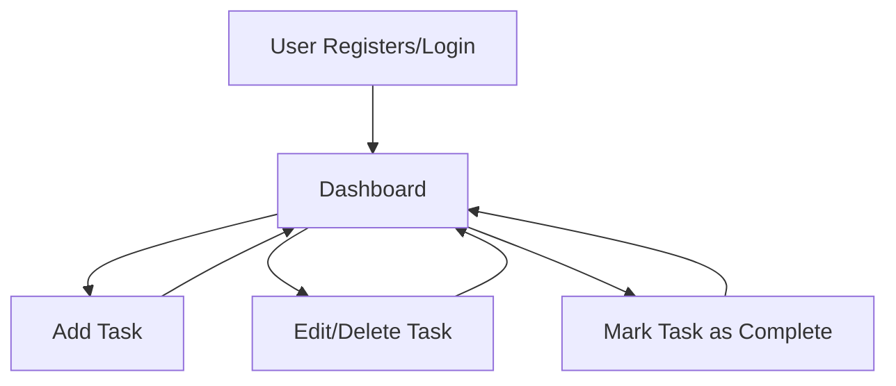

# Django Todo App

## Introduction

Django Todo App is a simple yet powerful web application designed to help users manage their daily tasks efficiently. Built using the Django framework, this project demonstrates robust CRUD functionalities and provides an intuitive interface for organizing todos. It is suitable for both beginners exploring Django and developers looking for a practical todo management solution.

## Features

- User authentication (login, registration, logout)
- Add, edit, and delete todo tasks
- Mark tasks as complete or pending
- View a list of all tasks with status indicators
- Responsive user interface with clear task management flow

## Requirements

To run Django Todo App, ensure you have the following:

- Python 3.7+
- Django 3.2+
- pip (Python package manager)
- SQLite (default, included with Django)
- Optional: virtualenv for isolated Python environments

## Installation

Follow these steps to set up the Django Todo App on your local machine:

1. **Clone the Repository**
   ```bash
   git clone https://github.com/JaiswalRajatj/Django-Todo-App.git
   cd Django-Todo-App
   ```

2. **Set Up a Virtual Environment (Optional but Recommended)**
   ```bash
   python -m venv venv
   source venv/bin/activate   # On Windows: venv\Scripts\activate
   ```

3. **Install Dependencies**
   ```bash
   pip install -r requirements.txt
   ```

4. **Apply Database Migrations**
   ```bash
   python manage.py migrate
   ```

5. **Create a Superuser (for admin access)**
   ```bash
   python manage.py createsuperuser
   ```

6. **Run the Development Server**
   ```bash
   python manage.py runserver
   ```

7. **Access the App**
   Open your browser and navigate to `http://127.0.0.1:8000/` to start using the Todo App.

## Usage

### User Registration and Login

- Visit the home page and register a new account.
- Login with your credentials to access your todo list.

### Managing Tasks

- After logging in, view your current tasks on the dashboard.
- Click **Add Task** to create a new todo.
- Use the edit or delete buttons next to each task to modify or remove tasks.
- Mark a task as completed by clicking the checkbox or status toggle.

### Admin Interface

- Access the Django admin at `/admin/` using the superuser credentials.
- Manage users and tasks directly from the admin dashboard.

### Typical Workflow



### API Endpoints

The Django Todo App is primarily web-based. If you have enabled API routes (such as with Django REST Framework), consult the respective documentation or `/api/` endpoints if available.

---

For more details, explore the code, templates, and Django configuration files within the repository. Contributions and suggestions are welcome!
